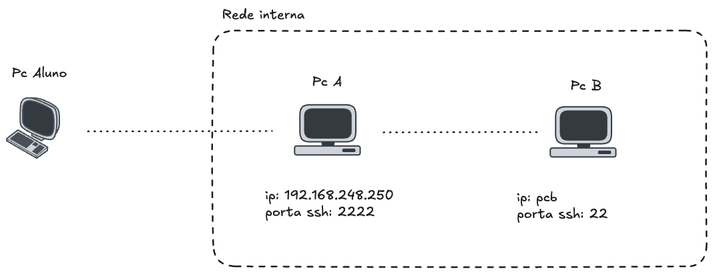

# Trabalho avaliação prática 3° Bim - SSH  22/09/2025

`Aluno`: **Felipe Barradas Sebastião**

Para responder às questões da avaliação prática, considere o seguinte cenário:



Na imagem, perceba que `Pc B` deve ser acessado pelo nome ao invés de seu endereço IP de fato.

## Questão 1

Faça o _download_ do arquivo `dino.jpg` para seu computador. Para tal, execute este comando:

```bash
wget https://materiais.darlon.com.br/build/dino_400x400_cinza-05195a9d91548dcebb9fc53490d4447e.jpg -O dino.jpg
```

Informe os passos necessários para:

- Criar o diretório _imagens_, dentro da _home_ do seu usuário em `Pc B`;
- Copiar a imagem `dino.jpg` de `Pc Aluno` para o diretório `imagens`, em `Pc B`.

Resposta:

```bash
scp -P 2222 dino.jpg felipebarradas@192.168.248.250:dino.jpg
ssh -p 2222 felipebarradas@192.168.248.250
scp -P 22 dino.jpg felipebarradas@pcb:dino.jpg
ssh -p 22 felipebarradas@pcb
mkdir imagens
cp dino.jpg imagens/dino.jpg
```


## Questão 2

Considere que a partir de `Pc A` são executados diversos comandos remotos em `Pc B`. Informe os passos necessários para que o acesso via ssh de `Pc A` para `Pc B` seja realizado sem a necessidade de uso de senha. Utilize criptografia `rsa` .

Resposta:

```bash
ssh -p 2222 felipebarradas@192.168.248.250
ssh-keygen -t rsa
cd .ssh
scp -P 22 id_rsa.pub felipebarradas@pcb:id_rsa.pub
ssh -p 22 felipebarradas@pcb
mkdir .ssh
cp id_rsa.pub .ssh/authorized_keys
```


## Questão 3

Na máquina `Pc A`, execute o seguinte comando:

```bash
cat /prova/codigo*.txt 2>/dev/null
```

Resposta:

```bash
ssh -p 2222 felipebarradas@192.168.248.250
cat /prova/codigo*.txt 2>/dev/null
```